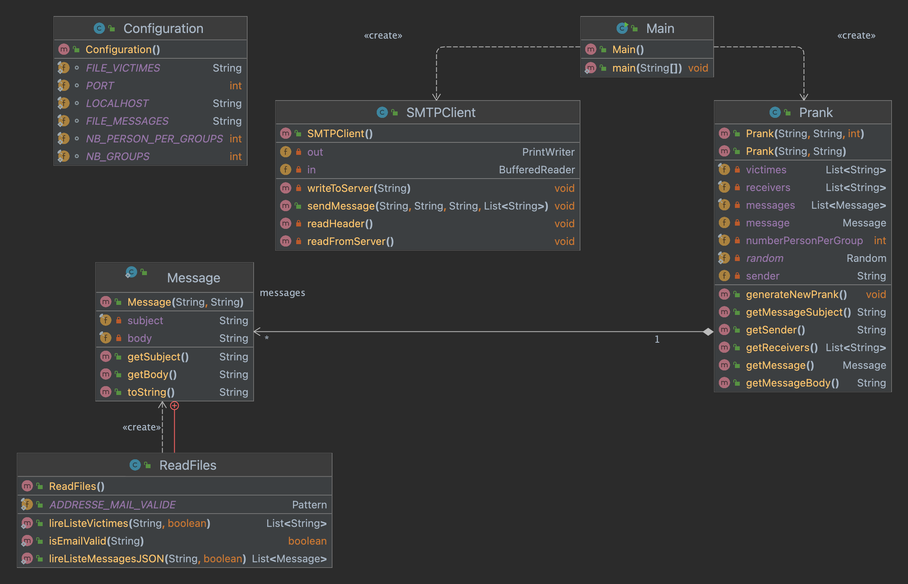

# Rapport laboratoire n°4 - SMTP

# Introduction
L'objectif de ce laboratoire est de mettre en place un client SMTP qui envoie des pranks à une liste de victimes.
L'utilisateur doit fournir une liste de victimes et une liste de messages à envoyer.

Pour tester que les messages SMTP soient correctement envoyés, nous avons mis en place un serveur Mock SMTP.
Ce serveur a été déployé en utilisant l'outil Docker. Pour le lancer, il faut exécuter, dans le terminal, la commande :  
    
    docker run -d -p 1080:1080 -p 1025:1025 maildev/maildev

Puis il suffit de lancer l'URL suivant pour visualiser le serveur Mock SMTP sur l'interface web : 

    http://localhost:1080

# MailDev
## Description
[MailDev](https://github.com/maildev/maildev) est un serveur de simulation qui appartient à la catégorie des outils permettant de reproduire 
le comportement d'un vrai service SMTP. Cette approche évite de surcharger un serveur SMTP en production, 
ce qui pourrait entraîner des problèmes de blacklistage.

# Client SMTP
## Configuration
Le client SMTP se configure en deux étapes :
- Etablir la liste de victimes et la liste de messages et les placer dans le répertoire "resources"
- Déterminer la taille d'un groupe et le nombre de groupes dans le fichier de [Configuration](src/main/java/ch/heig/dai_lab_smtp/Configuration.java)

### Etablir la liste de victimes et la liste de messages
Les adresses mails des victimes sont placées dans le fichier [victims](src/main/resources/victims.txt), 
chacune étant soumise à une validation par un motif spécifique.

Un message est composé d'un sujet et d'un corps de message. 

Les messages peuvent sont lus sous le format .json.
De plus, il faut placer les messages dans le répertoire [resources](src/main/resources).

### Déterminer la taille d'un groupe et le nombre de groupes

Dans la classe Configuration, il faut insérer le nombre de groupes souhaité ainsi que leur taille.
Ces informations détermineront le nombre de victimes du Prank.

D'autres informations, telles que le numéro de port ou les chemins absolus peuvent être également modifiées dans ce même fichier.

## Utilisation

Une fois toutes les configurations réalisées, il ne vous reste plus qu'à lancer le programme Main.
Pour réaliser cette étape, vous devez vous rendre dans le dossier qui contient l'exécutable, 
c'est-à-dire le dossier [Main](src/main/java/ch/heig/dai_lab_smtp/Main.java) et lancer le programme.

A titre informatif, le code a été rédigé en Java via un IDE tel qu'IntelliJ IDEA.

## Implémentation

Pour comprendre la présente implémentation, vous pouvez déchiffrer le diagramme UML suivant.

Le code se décompose en 4 parties :
- **Main** : cette section représente le thread principal
- **ReadFiles** : classe qui s'occupe de récupérer les informations des resources
- **Prank** : classe qui s'occupe de séparer l'expéditeur des destinataires au sein d'un groupe et d'établir le message à envoyer
- **SMTPCLient** : cette section est l'élément central de notre code. Il expédie, via un socket, un message aux différents acteurs d'un même groupe

## Exemple d'échange
Cette partie représente les messages du serveur suite à l'envoi d'un mail par le client.

    (S): 220 1e19ce8517f9 ESMTP
    (C): EHLO localhost
    (S): 250-PIPELINING
    (S): 250-8BITMIME
    (S): 250 SMTPUTF8
    (C): MAIL FROM: <calvin.graf@heig-vd.ch>
    (S): 250 Accepted
    (C): RCPT TO: <simon.guggisberg@heig-vd.ch>
    (S): 250 Accepted
    (C): RCPT TO: <valentin.bonzon@heig-vd.ch>
    (S): 250 Accepted
    (C): DATA
    (S): 354 End data with <CR><LF>.<CR><LF>
    (C): Content-Type: text/plain; charset=UTF-8
    (C): Subject: Pour notre amitié sans faille
    (C): From: <calvin.graf@heig-vd.ch>
    (C):
    (C): Salut,

    Je voulais juste prendre un moment pour te dire à quel point notre amitié compte pour moi. Tu es comme le code source de ma vie, apportant de la joie, de la stabilité et une tonne de rires. Nos moments partagés sont comme des fonctions bien définies : ils rendent ma vie beaucoup plus facile et plus amusante.

    Chaque fois que je pense à notre amitié, je me rends compte à quel point tu es une constante précieuse dans ma vie. Tu es le point virgule à mes phrases, la virgule à mes listes de moments heureux et le point d'exclamation à mes jours ordinaires.
    
    Merci d'être toujours là pour moi, même dans les moments les plus turbulents. J'apprécie chaque ligne de code que nous avons écrite ensemble dans le grand livre de notre amitié.
    
    À toutes nos aventures passées et à venir !
    (C):
    .
    
    (C): QUIT

